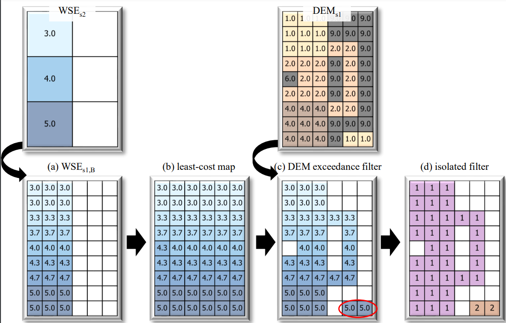

[](https://doi.org/10.5281/zenodo.10969456)

# FloodDownscaler

Tools for downscaling/disaggregating flood hazard grids


 

## Use
To downscale a coarse WSE using a fine resolution DEM, the CLI in main.py can be used:
```
python fdsc\main.py <path_to_DEM> <path_to_WSE>
```
an example application with this CLI is provided in [example.bat](./example.bat)

Alternatively, the `downscale` function can be called within a python script:
```
from fdsc.main import downscale
downscale(<path_to_DEM>, <path_to_WSE>)
>>> <path_to_WSE1>, {metadata}
```

### Supported downscaling methods
The following downscaling algos have been implemented. These are typically specified via the `method` key:
#### CostGrow
employs four phases shown below: 1) grid resampling; 2) least-cost mapping; 3) filtering high-and-dry sub-grid cells; and finally 4) an isolated-cell filter.

 

## Related projects
[FloodDownscaler](https://github.com/cefect/FloodDownscaler): original repo for HESS publication work

[FloodRescaler](https://github.com/cefect/FloodRescaler): public repo with QGIS processing script port (and aggregation tools)

[rimpy](https://git.gfz-potsdam.de/bryant/rimpy): Tools for building, calibrating, and visualizing RIM2D models
 
[2207_dscale2](https://github.com/cefect/2207_dscale2): (**DISCONTINUED**) project for generating analog inundation grids with LISFLOOD. 

[FloodPolisher](https://github.com/cefect/FloodPolisher): (**DISCONTINUED**) mid-2022 inundation downscaling work using simple growth. pyqgis. Should incorporate a version of this into this project. 

[2112_agg_pub](https://github.com/cefect/2112_agg_pub): public repo of analysis for aggregation paper. 

## Installation
TODO: make installation more user-friendly (e.g., containerization or setup-tools)

Installing FloodDownscaler2 is complex and customizeable and requires three basic steps:
- build a python environment per ./environment.yml
- create and customize a ./definitions.py file (see below)
- install/setup whitebox-tools (see below)

Once setup is complete, its highly advisable to test your install by updating/running ./example.bat
Typically, I build a conda/miniforge environment in windows ./env and write a batch script to activate this (`./env/conda_activate.bat`)

### setting up whitebox-tools
Some of the functions depend on whitebox-tools (wbt) python API. For these to work, installing FloodDownscaler2 requires installing whitebox-tools (if you haven't already) and telling FloodDownscaler2 where to find it. Below is some guidance/instructions for configuring wbt; however, there are a few ways to do this and not all ways work on all systems. 

#### wbt is already installed
set an environment variable to point to your whitebox-tools executable location:
- preferred: `FDSC_WBT_DIR`
- fallbacks recognized by this repo: `WHITEBOXTOOLS_DIR`, `WBT_DIR`

You can set either:
- the directory containing `whitebox_tools` (or `whitebox_tools.exe` on Windows), or
- the full executable path.

Examples:
```bash
# Linux/macOS
export FDSC_WBT_DIR="/path/to/whitebox-tools/target/release"

# Windows (PowerShell)
$env:FDSC_WBT_DIR="L:\09_REPOS\05_FORKS\whitebox-tools\target\release"
```

If no env var is set (or it is invalid), FloodDownscaler2 falls back to the executable bundled by the installed `whitebox` Python package.

#### install wbt from precompiled binary
compiled binaries are available [here](https://www.whiteboxgeo.com/download-direct/) for common systems. 

#### building wbt from source


#### building wbt from source as a submodule

This is the preferred method as it provides greater version control. Typically, FloodDownscaler2 project is setup to use whitebox-tools v2.2.0 as a submodule. 
Typical workflow:
- clone whitebox-tools into the repo as a submodule and point to the v2.2.0 release tag.
```
git submodule add -b v2.2.0_tweaks https://github.com/cefect/whitebox-tools.git
git mv whitebox-tools whiteboxtools
```
- compile the tools. call the below within the newly cloned submodule folder. this may take a while and requires you to have rust installed (see whitebox-tools documentation for more info)
`cargo build --release`
- update paths per the above


### PYTHONPATH
The project requires the PYTHONPATH to include the source directory.

If you are using a source-built whitebox-tools executable, set `FDSC_WBT_DIR` instead of extending `PYTHONPATH`.

Below is an example for a project path:
```
PROJECT_DIR_NAME
```

### definitions.py

```

import os
#default working directory
wrk_dir = r'L:\10_IO\fdsc2'

#test source data directory
test_data_dir = r'l:\10_IO\fdsc2\test_data'
 
```

## Tests
pytests are in ./tests

NOTE: coverage is poor
